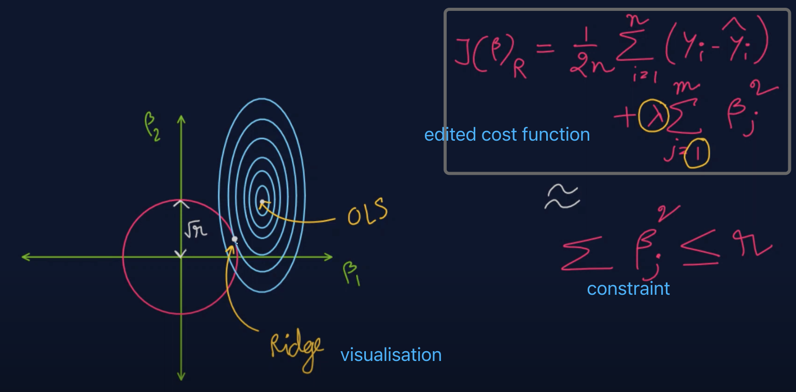

# Predict Cancer Mortality Rates in US Counties And Classification of 1-year patient mortality following a heart attack

## Project Overview

**First part**: Tasks involve building multiple models(OLS, Lasso, Ridge) to predict cancer mortality rates in US counties. The dataset provided comprises various features/predictors related to socio-economic characteristics and other types of information for specific counties in the country. The goal of the project is to create a model that can accurately predict cancer mortality rates in counties.

**Second part**: Tasks involve building two models(Logistic regression classifiers and Random Forest classifier) to classify 1-year patient mortality following a heart attack.

The project is divided into the following exercises:

1. Data exploration, visualization, and correlation analysis
2. Pre-processing the data using scikit-learn pipeline
3. Fitting models and comparing their performance
4. Identifying the most important features.

## Technology and Methology

This project utilized Python programming language and its popular data analysis and machine learning libraries, including **scikit-learn**, **pandas**, **numpy**, and **matplotlib**. I employed a systematic approach that encompassed **data exploration**, **visualization**, **pre-processing**, **and model development**.

The methodology involved multiple steps, starting with **data exploration and visualization** to **identify patterns** and **outliers**. I then used a **scikit-learn pipeline** for pre-processing the data, followed by fitting **linear regression** models, including **Ordinary Least Squares (OLS), Lasso, and Ridge**, and **Random Forest classifer** and **Logistic Regression Classifier**. 

<u>This project demonstrated the effectiveness of utilizing machine learning techniques</u>.

## Data

The dataset provided includes 'Training_data.csv' and 'Training_data_targets.csv' files. 'Training_data.csv' contains various socio-economic and other features for specific US counties, while 'Training_data_targets.csv' contains the corresponding target variables for the training set.

**Data Dictionary 1** 

| Feature                 | Description                                                  |
| ----------------------- | ------------------------------------------------------------ |
| avgAnnCount             | Mean number of reported cases of cancer diagnosed annually   |
| avgDeathsPerYear        | Mean number of reported mortalities due to cancer            |
| incidenceRate           | Mean per capita (100,000) cancer diagnoses                   |
| medianIncome            | Median income per county                                     |
| popEst2015              | Population of county                                         |
| povertyPercent          | Percent of populace in poverty                               |
| MedianAge               | Median age of county residents                               |
| MedianAgeMale           | Median age of male county residents                          |
| MedianAgeFemale         | Median age of female county residents                        |
| AvgHouseholdSize        | Mean household size of county                                |
| PercentMarried          | Percent of county residents who are married                  |
| PctNoHS18_24            | Percent of county residents ages 18-24 highest education attained: less than high school |
| PctHS18_24              | Percent of county residents ages 18-24 highest education attained: high school diploma |
| PctSomeCol18_24         | Percent of county residents ages 18-24 highest education attained: some college |
| PctBachDeg18_24         | Percent of county residents ages 18-24 highest education attained: bachelor's degree |
| PctHS25_Over            | Percent of county residents ages 25 and over highest education attained: high school diploma |
| PctBachDeg25_Over       | Percent of county residents ages 25 and over highest education attained: bachelor's degree |
| PctEmployed16_Over      | Percent of county residents ages 16 and over employed        |
| PctUnemployed16_Over    | Percent of county residents ages 16 and over unemployed      |
| PctPrivateCoverage      | Percent of county residents with private health coverage     |
| PctPrivateCoverageAlone | Percent of county residents with private health coverage alone (no public assistance) |
| PctEmpPrivCoverage      | Percent of county residents with employee-provided private health coverage |
| PctPublicCoverage       | Percent of county residents with government-provided health coverage |
| PctPubliceCoverageAlone | Percent of county residents with government-provided health coverage alone |
| PctWhite                | Percent of county residents who identify as White            |
| PctBlack                | Percent of county residents who identify as Black            |
| PctAsian                | Percent of county residents who identify as Asian            |
| PctOtherRace            | Percent of county residents who identify in a category which is not White, Black, or Asian |
| PctMarriedHouseholds    | Percent of married households                                |
| BirthRate               | Number of live births relative to number of women in county  |

**Data Dictionary 2**

| Feature               | Description                                                  |
| --------------------- | ------------------------------------------------------------ |
| Age-at-heart-attack   | Age in years when heart attack occurred                      |
| Pericardial-effusion  | Pericardial effusion is fluid around the heart.  0=no fluid, 1=fluid |
| Fractional-shortening | A measure of contracility around the heart lower numbers are increasingly abnormal |
| Epss                  | E-point septal separation, another measure of contractility. Larger numbers are increasingly abnormal. |
| Lvdd                  | Left ventricular end-diastolic dimension.  This is a measure of the size of the heart at end-diastole.Large hearts tend to be sick hearts. |
| Wall-motion-index     | Equals wall-motion-score divided by number of segments seen. Usually 12-13 segments are seen in an echocardiogram. |

## Requirements

- Python 3.7+
- scikit-learn
- pandas
- numpy
- matplotlib

## Results

The results of the project will include the best performing regression model, important features, and the performance comparison between the models.

## License

This project is licensed under the MIT License. See the [LICENSE](https://chat.openai.com/LICENSE) file for more information.

### Some complement:

df_all.corr(): 
> Under the hood,'df_all.corr()' use Pearson correlation coefficient.
>
> First calcualte covariance:
> cov(X,Y) = (sum[(x_i - mean(X))*(y_i - mean(Y))]) / (n)
> Then calcualte the standard deviation:
> std_dev(X) = sqrt(sum[(x_i - mean(X))^2] / (n))
>
> Then Pearson correlation:
> corr(X,Y) = cov(X,Y) / (std_dev(X) * std_dev(Y))

Gridsearch: GridSearchCV
from sklearn.model_selection import GridSearchCV

> 1. Make a dictionary of hyperparameter values you want to search in order to find the best vlaue for hyperparameter
> 2. set a score method to evaluate how good the module perform.
> 3. use cross validation to caculate score then decide the best hyperparameter

**OLS(Ordinary least square), Ridge,Lasso**

>from sklearn.linear_model import LinearRegression, Lasso, Ridge
>
>https://www.youtube.com/watch?v=9ByTWfZBsTE
>
>OLS: cost function: sum((y_true - y_pred)**2) / n
>
><u>Lasso and Ridge are two ways to avoid overfitting</u>: add a new term on cost function 
>Overfitting always happend with the extramly large value of **weights**, so we use weights below apart from bias.
>
>- Ridge: add the sum of the squares of **weights**
>  
>   This will make sure no feature can be too much importance than others.
>- Lasso: add the sum of absolute value of **weights**
>- Lambda:
>  Increasing: bias increases, the model won't learn the details then lead to underfitting.
>   0: euquals to OLS

**RF**

> from sklearn.ensemble import RandomForestRegressor
>
> Generate trees by chosing features randomly.
> The number of trees and max number of featues will be set in advance.

- Visual analysis
- 各fields之间的关系
- Create an ML pipeline to pre-process the data.

